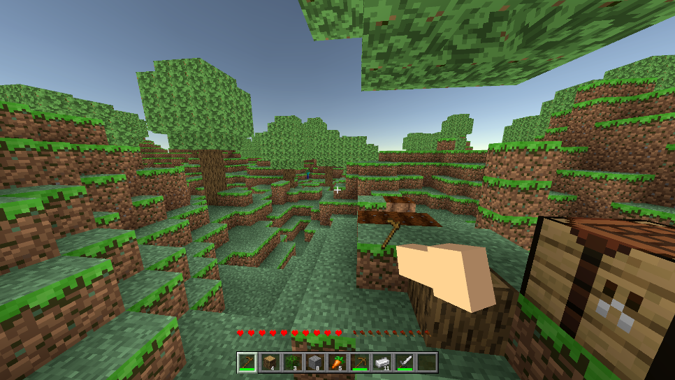
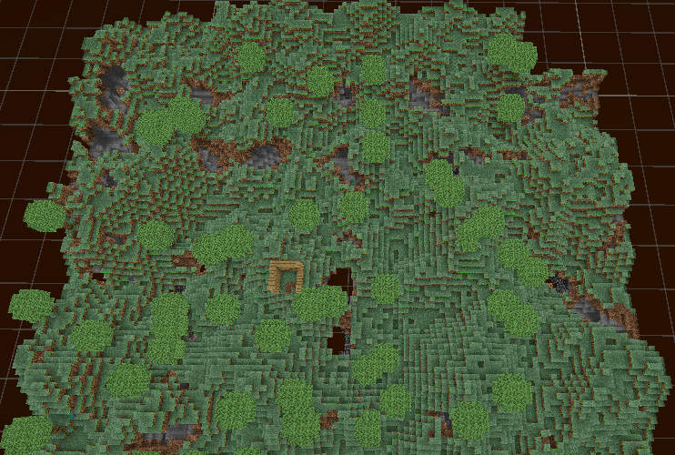
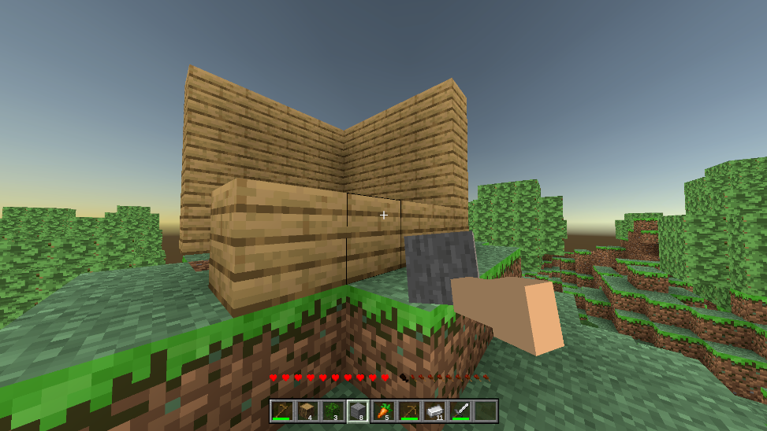
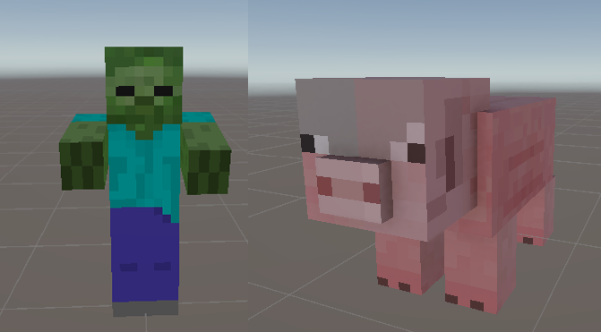

# Simple Minecraft FanMade (Unity)

A voxel-based sandbox game project developed with Unity, inspired by Minecraft. This project focuses on creating an infinite procedurally generated world, block interaction systems, and basic survival mechanics.

## Key Features

### 1. World & Environment
- **Procedural Generation**:
  - Utilizes **Perlin Noise** algorithms to create natural terrain, including mountains, valleys, and caves.
  - Trees and vegetation are randomly distributed based on environmental parameters.
- **High-Performance Chunk System**:
  - The infinite world is divided into Chunks (16x16x128 blocks).
  - **Dynamic Loading/Unloading**: Only renders chunks within the player's view distance to ensure stable FPS.
- **Biome**:
  - Currently focuses on a single dominant biome with distinct grass colors, tree types, and terrain features.
- **Voxel Lighting**:
  - Calculates the propagation of sunlight and artificial light (Torches) through each block.
  - Local "Light Baking" system ensures a smooth experience.

### 2. Gameplay & Interaction
- **Block Interaction**:
  - **Mining**: Break and collect resources from various block types (Dirt, Stone, Wood, Leaves, Ores...).
  - **Building**: Freely place blocks to build structures limited only by imagination.
  - **Block Highlighting**: Displays a clear black outline around the targeted block for precise interaction.
- **Entity & AI**:
  - **Passive Mobs (Pig)**: Wander around, react to physics, adding life to the world.
  - **Hostile Mobs (Zombie)**:
    - Automatically spawn at night or in dark places.
    - Basic Pathfinding AI to chase and attack the player.
  - **Spawner System**: Controls the density and spawn locations of entities.
- **Real-Time Cycle**:
  - Continuous Day/Night cycle.
  - Sky changes color over time (Sunrise, Sunset, Moonlit Night).
- **Crafting & Equipment**:
  - **Crafting**: Intuitive crafting interface, supporting recipe combinations to create essential tools and items.
  - **Tools**: Includes Pickaxe (mining stone), Axe (chopping wood), Shovel (digging dirt).
  - **Weapons**: Equip Swords to defend and effectively attack threats.

### 3. Player System
- **Flexible FPS Control**:
  - First-person camera with customizable sensitivity.
  - Smooth interaction with the surrounding environment.
- **Locomotion**:
  - **Walk**: Standard movement.
  - **Sprint**: Increase movement speed to explore the vast world.
  - **Jump**: Overcome obstacles and climb terrain.
- **Combat & Survival**:
  - Melee attack system with Knockback feedback.
  - Health and damage management when colliding with monsters.
- **Held Item System**:
  - Displays 3D models of the item/block currently held in the right hand.
  - Sway animation when moving creates a realistic feel.

## Screenshots
> *Please replace the links below with actual project screenshots*

| Gameplay | World |
|:---:|:---:|
|  |  |

| Building | Mob & AI |
|:---:|:---:|
|  |  |

## Technical Requirements
- **Unity Engine**: Version 6000.2.7f2 (recommended).

## Installation & Run

1. **Clone Repository**:
   ```bash
   git clone "https://github.com/duongdatdev/simple_minecraft_unity.git"
   ```
2. **Open Unity Hub**:
   - Click **Add** and select the project folder.
3. **Open Project**:
   - Wait for Unity to Import necessary assets and packages.
4. **Play Game**:
   - Open the main Scene (usually in `Assets/Scenes`).
   - Press the **Play** button on the toolbar.

## Controls Guide

| Action | Keyboard / Mouse |
|--------|------------------|
| **Move** | W, A, S, D or Arrows |
| **Look** | Mouse |
| **Attack / Break** | Left Click |
| **Place / Interact** | E |
| **Jump** | Space |
| **Sprint** | Left Shift |
| **Select Item** | 1 -> 9 |
| **Menu / UI** | Esc |

## Project Structure (Overview)

- `Assets/Scripts/Core`: Core scripts managing game state.
- `Assets/Scripts/World`: World generation logic, Chunks, Block data, lighting, and AI (Zombie, Pig).
- `Assets/Scripts/Player`: Player controller, camera collision handling, block interaction.
- `Assets/Scripts/UI`: User Interface.

## Contribution
All contributions are welcomed. Please create a Pull Request or open an Issue if you find bugs or want to propose new features.
